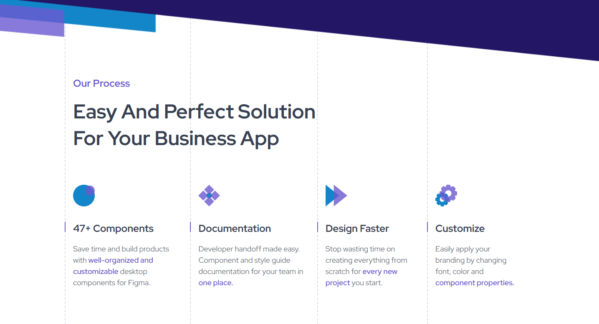

<h1 align="center"> Process Page | devChallenges</h1>

   Solution for a challenge <a href="https://devchallenges.io/challenge/process-page" target="_blank">Process Page</a> from <a href="http://devchallenges.io" target="_blank">devChallenges.io</a>.

  <h3>
    <a href="https://codebyev.github.io/process-page">
      Demo
    </a>
     | 
    <a href="https://devchallenges.io/challenge/process-page">
      Challenge
    </a>
  </h3>

<!-- OVERVIEW -->

## Overview

Challenge by devchallenges.io to create Process Page using HTML and CSS.